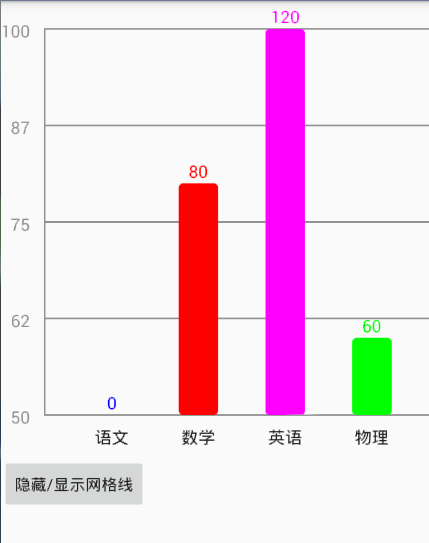
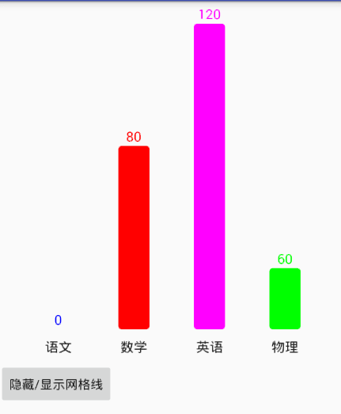
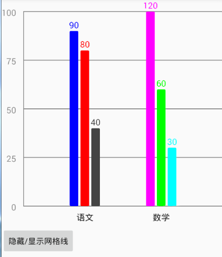
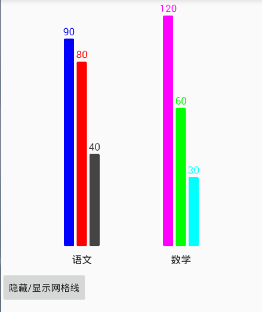
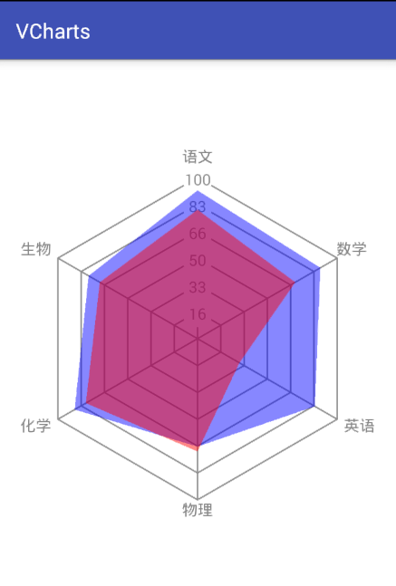
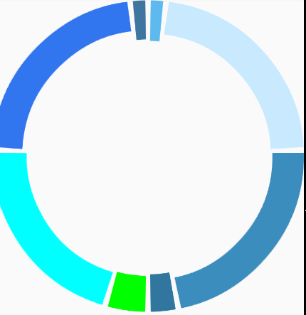
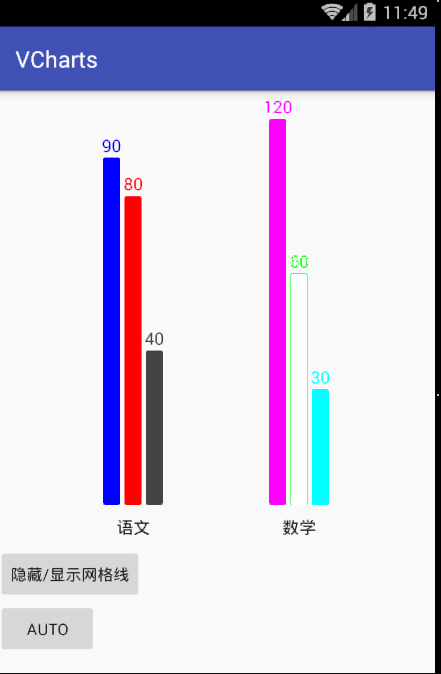

# VCharts

## Preview([demo](apk/app-debug.apk))


       

## 适配AUTO([AutoLayout](https://github.com/hongyangAndroid/AndroidAutoLayout))


>view.setAuto(boolean);//默认开启

## usage([demo](apk/app-debug.apk))

>compile 'com.vinctor:vcharts:x.y.z'

lastest version：x.y.z-> 

### 雷达图

添加至```xml```中

     <com.vinctor.vchartviews.radar.RadarChart
            android:id="@+id/radarview"
            android:layout_width="match_parent"
            android:layout_height="match_parent" />
            
```java```代码中

           radarView.setCount(6)//多边形几条边
                .setDensity(6)//雷达图蜘蛛网密度
                .setMinAndMax(0, 100)//最小与最大值
                .setAlpha(150)//雷达图数据遮盖透明度
                .clearData()//清楚数据
                .setList(list)//设置数据
                .addData(data)//添加数据
                .setTitleTextSize(30)//雷达边角标题文字大小(px)默认30
                .setTagTextSize(30)//雷达刻度文字大小
                .setTitles(new String[]{"语文", "数学", "英语", "物理", "化学", "生物"})//边角文字
                .commit();//以上设置需要此方法才能生效

### 单条柱状图

添加至```xml```中

    <com.vinctor.vchartviews.bar.BarCharSingle
        android:id="@+id/bar"
        android:layout_width="match_parent"
        android:layout_height="400dp"
        app:barTextSize="28px"
        app:barTitleMargin="28px"
        app:barWidth="58px"
        app:density="5"
        app:gradutaionColor="@color/$d2d2d2"
        app:gradutaionLineWidth="2px"
        app:gradutionTextSize="26px"
        app:max="100"
        app:min="0"
        app:titleColor="@color/$999999"
        app:titleTextSize="32px"/>
        
```java```代码中

      singleBar = (BarCharSingle) findViewById(R.id.bar_single);
        singleBar.setShowGraduation(true)
                .setMinAndMax(50, 100)
                .setDensity(4)//数值方向的刻度密度
                .setBarWidth(30)//柱状图宽度.默认为宽度的1/10
                .setGraduationTextSize(30)//左侧刻度的文字大小
                .setTitleTextSize(30)//底部文字大小
                .setBarTextSize(30)//柱状图上方数字大小
                .commit();
        singleBar.setData(new BarDataSingle("语文", 0, Color.BLUE))
                .addData(new BarDataSingle("数学", 80, Color.RED))
                .addData(new BarDataSingle("英语", 120, Color.MAGENTA))
                .addData(new BarDataSingle("物理", 60, Color.GREEN))
                .commit();
                
                
### 多条柱状图

添加至```xml```中

    <com.vinctor.vchartviews.bar.BarCharMulti
                    android:id="@+id/bar"
                    android:layout_width="match_parent"
                    android:layout_height="500px"
                    android:layout_marginTop="34px"
                    app:barTextSize="28px"
                    app:barTitleMargin="28px"
                    app:barWidth="58px"
                    app:density="5"
                    app:gradutaionColor="@color/$d2d2d2"
                    app:gradutaionLineWidth="2px"
                    app:gradutionTextSize="26px"
                    app:max="100"
                    app:min="0"
                    app:titleColor="@color/$999999"
                    app:titleTextSize="32px" />
        
```java```代码中

       multiBar = (BarCharMulti) findViewById(R.id.bar_multi);
        multiBar.setShowGraduation(true)
                .setMinAndMax(0, 100)
                .setShowGraduation(false)
                .setDensity(4)//数值方向的刻度密度
                .setBarWidth(30)//柱状图宽度.默认为宽度的1/10
                .setGraduationTextSize(30)//左侧刻度的文字大小
                .setTitleTextSize(30)//底部文字大小
                .setBarTextSize(30)//柱状图上方数字大小
                .commit();
        List<SingleData> singles = new ArrayList<>();
        singles.add(new SingleData(90, Color.BLUE));
        singles.add(new SingleData(80, Color.RED));
        singles.add(new SingleData(40, Color.DKGRAY));
        
        List<SingleData> singles2 = new ArrayList<>();
        singles2.add(new SingleData(120, Color.MAGENTA));
        singles2.add(new SingleData(60, Color.GREEN));
        singles2.add(new SingleData(30, Color.CYAN));
        
         multiBar.setBarGroupCount(3)//设置每组中柱状图的个数
                    .addData(new BarDataMulti(singles, "语文"))
                    .addData(new BarDataMulti(singles2, "数学"))
                    .commit();
                  
### 折线图

添加至```xml```中

      <com.vinctor.vchartviews.line.LineChart
                    android:id="@+id/line"
                    android:layout_width="match_parent"
                    android:layout_height="500px"
                    android:layout_marginTop="34px"
                    app:lineGradutaionColor="@color/$d2d2d2"
                    app:lineGradutaionLineWidth="2px"
                    app:lineGradutionTextSize="26px"
                    app:lineMax="100"
                    app:lineMin="0"
                    app:lineTitleColor="@color/$9b9b9b"
                    app:lineTitleTextSize="32px"
                    app:linedensity="5" />
        
```java```中

      line.setDensity(5)
                  .setShowAnimation(true)//动画
                  .setTitleTextSize(30)//底部标题大小
                .setLineSmoothness(0.3f)//折线平滑度
                .setCoordinateTextSize(30)//刻度文字大小
                .setCoorinateColor(0xff888888)//刻度文字颜色
                .setLineStrokeWidth(8)//网格线宽度
                .setTitles(new String[]{"语文", "数学", "英语", "物理", "化学"})//底部标题,需与折线数据长度一致
                .setTitleTextSize(30)//底部标题文字大小
                .setMinAndMax(-100, 100)
                .addData(new LineData(new int[]{20, 50, 20, 70, 0}, 0xff61B6E7))//需与title长度一致
                .addData(new LineData(new int[]{30, 80, 50, 60, 100}, 0xffF8AC58))
                .addData(new LineData(new int[]{-10, 30, 60, 80, 1500}, 0xffF593A0))
                .commit();
       //底部title点击事件
        line.setOnTitleClickListener(new LineChart.OnTitleClickListener() {
            @Override
            public void onClick(LineChart linechart, String title, int index) {
                ToastUtil.show(title + "index--" + index);
            }
        });
                
### 环形图

```xml```中

     <com.vinctor.vchartviews.ring.RingChart
        android:id="@+id/pie"
        android:layout_width="match_parent"
        android:layout_height="400dp" />
        
 ```java```:
 
     chart = (RingChart) findViewById(R.id.pie);

        List<Data> datas = new ArrayList<>();
        datas.add(new Data(1, "1人掌握"));
        datas.add(new Data(17, "17人掌握"));
        datas.add(new Data(17, "17人掌握"));
        datas.add(new Data(2, "2人掌握"));
        datas.add(new Data(3, "3人掌握"));
        datas.add(new Data(16, "16人掌握"));
        datas.add(new Data(17, "17人掌握"));
        datas.add(new Data(1, "1人掌握"));

        chart.setMaxRingWidth(100)
                .setMinRingWidth(70)
                .setData(new RingData(datas,
                        new int[]{0xff5EB9EE, 0xffC9E9FE, 0xff3B8DBD, 0xff31769F, Color.GREEN, Color.CYAN, 0xff3176eF, 0xff3f769F,}));
  
### 图例

#### 单图例

      <com.vinctor.vchartviews.diagram.DiagramView
        android:layout_width="wrap_content"
        android:layout_height="wrap_content"
        app:content="图例"
        app:contentColor="#9b9b9b"
        app:contentMargin="14px"
        app:contentSize="24px"
        app:viewColor="#9b9b9b"
        app:viewSize="20px" />
        
 #### 多图例

```xml```中

      <com.vinctor.vchartviews.diagram.DiagramFlowLayout
        android:id="@+id/flowlayout"
        android:layout_width="wrap_content"
        android:layout_height="wrap_content"
        android:layout_marginBottom="18px"
        app:contentColor="#9b9b9b"
        app:contentMargin="14px"
        app:contentSize="24px"
        app:viewSize="20px" />
        
```java```中

      DiagramFlowLayout flowLayout = (DiagramFlowLayout) findViewById(R.id.flowlayout);
        List<DiagramData> list = new ArrayList<>();
        list.add(new DiagramData(0xff3B8DBD, "0~25个知识点"));
        list.add(new DiagramData(0xff30769F, "25~50个知识点"));
        list.add(new DiagramData(0xffC8E9FE, "50~75个知识点"));
        list.add(new DiagramData(0xff5EB9EE, "75~100个知识点"));
        flowLayout.setList(list);

     
### 未完待续
